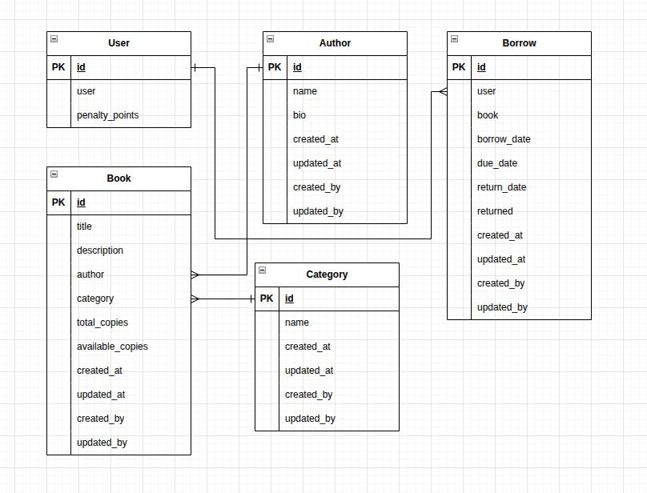

# Library Management System API

A Django REST API for a Library Management System that supports user registration, book browsing, borrowing, and returning functionality.

## Features

- User registration and JWT authentication
- Book browsing with filtering options
- Book borrowing with inventory management
- Book returning with penalty calculation
- Admin-only book, author, and category management
- API rate limiting


## Setup Instructions

1. Clone the repository:
   ```bash
   git clone https://gitlab.com/aj_nishad/library-api
   cd library-api
   ```

2. Create and activate a virtual environment:
   ```bash
   python -m venv venv
   source venv/bin/activate
   ```

3. Install dependencies:
   ```bash
   pip install -r requirements.txt
   ```

4. Run migrations:
   ```bash
   python manage.py makemigrations
   python manage.py migrate
   ```


5. Create a superuser (if not using sample data):
   ```bash
   python manage.py createsuperuser
   ```

6. Run the development server:
   ```bash
   python manage.py runserver
   ```

7. Access the API

* Base URL: http://127.0.0.1:8000/api/
* Postman Collection: [Sparktech Agency Collection](https://www.postman.com/bold-eclipse-977420/workspace/sparktech-agency/collection/29026314-06325977-6641-43c4-adcb-7d6ca772d040?action=share&creator=29026314)

## 🧠 Approach & Implementation Explanations
#### 🔐 Authentication & Users
Implemented JWT authentication using `djangorestframework-simplejwt`.

Extended Django's default user model to include `penalty_points` for tracking late returns.

### 📘 Book Management
Created models for `Book`, `Author`, and `Category` with clear foreign key relationships.

Admin-only endpoints use custom permissions (`IsAdminUser`) to control access.

Public API users can browse books with filters (author, category) using Django Filter Backend.

### 🔄 Borrowing System
The `/api/borrow/` endpoint:

Enforces a borrowing limit of 3 active books per user.

Checks that the book has available copies.

Uses `transaction.atomic()` to safely update available copies and create a borrow record.

Automatically calculates `due_date = borrow_date + 14 days`.

The `/api/return/` endpoint:

Accepts a borrow ID to mark a book as returned.

Updates the `return_date` and restores inventory atomically.

Calculates penalty points for late returns (1 point per day late).

### 📂 Other Functionalities
`/api/users/{id}/penalties/` provides penalty details, accessible by admins or the user.

Applied basic rate-limiting per user using DRF’s built-in throttling settings.

Book metadata (author/category) is managed via dedicated endpoints.

### 🔍 Assumptions & Notes
Time zone handling is based on the server’s settings (`USE_TZ=True`).

Penalty calculation assumes a static 1 point/day late policy, which can be extended.

The email reminder feature for due dates is planned but not implemented in this version.

### 📊 ER Diagram



### 📄 API Documentation
All endpoints and request/response examples are available in the linked [Postman Collection](https://www.postman.com/bold-eclipse-977420/workspace/sparktech-agency/collection/29026314-06325977-6641-43c4-adcb-7d6ca772d040?action=share&creator=29026314).


